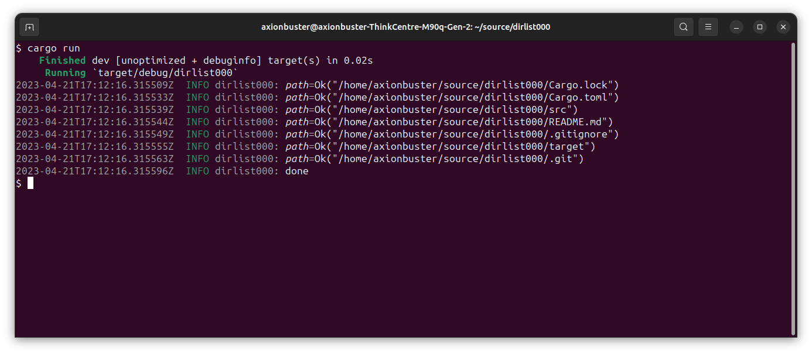

# Directory Listing using Streams in Rust

Procedure to create a generic stream iterator that can abstract out
the backends (i.e., whether I'm using Tokio against a real filesystem
or an in-memory implementation I hand-rolled myself, or someone else's
system).

## Concept: Pinning

- Move: All values in Rust can be moved in memory, which means to
copy the contents of the value and make the old value invalid. This is
a combination of pass-by-value semantics and use-at-most-once logic.
- Problem: From time to time, asynchronous code requires a pointer address
to be stable, which is incompatible with the possibility of moving.
In safe, sync code, it is impossible for a reference to assume a
different memory address before the reference itself is destroyed due to
the action of a different thread of execution. But in async code, it's
possible and permitted in safe Rust. Forcing async code to not rely on a
stable reference across await points is a difficult restriction.
- Pinning: disallows a value from being moved, guaranteeing a stable
memory address for any reference relative to the value.
- Mechanism: a value behind any `&mut _` (exclusive reference) can be
moved at any time in safe Rust. Thus, pinning introduces an abstraction,
the `Pin<_>` smart pointer, that *absorbs* and *hides* the exclusive
reference and only exposes it over the `AsRef<_>` and `Deref<_>` traits.
- `Pin<_>` supports other types of pointers as well.
- Deep Dive: suppose a piece of async code creates an array (`a`)
and a slice of the vector called `s`. In async code, the state of a
(green) thread turns into a Rust structure (a future) that has the
`s` and `a` fields, respectively. Suppose this structure is at the address `f`.
Then, `f = &a` at all times and, at some point, `s = f + (constant)`.
*Now*, if the future moves to, say, `g`, a different pointer address, then
`&a` is now `g` by contract, but, `s` stays at `f + (constant)`. To solve
this problem, Rust decided that the future may not move across different
memory addresses. Since moves can be done either by ownership or by
holding an exclusive access, Rust decided to protect the future itself
from getting moved by protecting its mutable reference.
- `Pin<&mut _>`: Takes an exclusive reference `&mut T` and then hides
it. It implements the appropriate `AsRef` and `Deref` traits to allow
indirect access.
- `Unpin`: Many values in Rust do not *require* pinning to work correctly.
If a type `T` implements `Unpin`, then `Pin<&mut T>` can be destroyed
and reveal the exclusive reference by using `&mut *my_pinned_t`
(given that `my_pinned_t: Pin<&mut T>`). `Unpin` is implemented by
default for all values unless it impelements / should implement `!Unpin`.
- `Box<Pin<_>>`: Is a common combination that represents a value in
heap memory that may not be moved (only destroyed).
- Why Pin: Futures (asynchronous threads) frequently get swapped across
threads while holding a reference to values. As described, Safe Rust
allows any value to be moved while the thread holds an exclusive reference to it.
In asynchronous code, holding an exclusive reference does not guarantee
the object will be accessible at a constant pointer location. To
elaborate, the object will still be *live* due to the lifetime
semantics, but it won't be *exactly there* because it could be at a
difference memory location. So it's hazardous to hold these pointers
because they can be invalidated, even in safe Rust, whether these values
reside in heap memory or stack memory or even read-only memory.

## Concept: Stream

- Kinda like an asynchronous iterator tbh, didn't look too much into it.
- You return `Some(_)`, you still getting values, and you return `None`,
boom, the stream is over.
- You also need to return a correct implementation of `size_hint(_)`,
which gives an absolute upper bound of the number of elements to come.
An always-correct implementation gives positive infinity, represented
by `None` (as opposed to a concrete value, a `Some(usize)`). This
`size_hint(_)` implementation is provided by default.
- You can make a `Stream` behave like an `Iterator` by importing
`tokio_stream::StreamExt`, if you're using the `tokio-stream` crate.

## Concept: Zero-Sized Types

- These things are structures that occupy no space in memory.
- Lots of funky things happen when it comes to addressing and allocating
them, but since ZST's are in safe Rust, no need to worry.
- A ZST with public constructor can be created by having a semicolon
or an empty pair of brackets or parentheses right after the structure's
name like this: `struct MyStruct;`, `struct MyStruct{}`,
`struct MyStruct()`.
- A ZST with private constructor can be created by having only other ZST
inside it: `struct MyStruct(())` for example.
- I used a ZST here to implement Dependency Injection: I needed a list
of functions to implement (generically), so I used a trait for that.
Only structures or other traits can implement a trait. My implementation,
by using Tokio, didn't have a need to keep any state, so I used a ZST.
- Admittedly, the Dependency Injection isn't fully implemented.
I have separated the interface (trait `Vfs`) and the implementation
(`TokioVfs`), but I don't have the *injection* part.

## Demo: Directory Listing

### Preparation

- A stream with `Item = Result<PathBuf, anyhow::Error>` is defined.
- Tokio has a convenient directory listing procedure that is exposed
as a stream. I wrap Tokio's stream into my stream implementation.

### Procedure

1. The current directory is retrieved.
2. Tokio's stream is constructed and then converted into mine. To do so,
I redirect any errors to `anyhow::Error`, and if there is no error, I
extract its file path and then wrap it in `Ok(_)`.
3. Print each path.

### Reproduction

1. Clone (download) this repository.
2. Run `cargo run`.
3. And then see.
